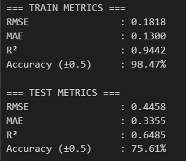
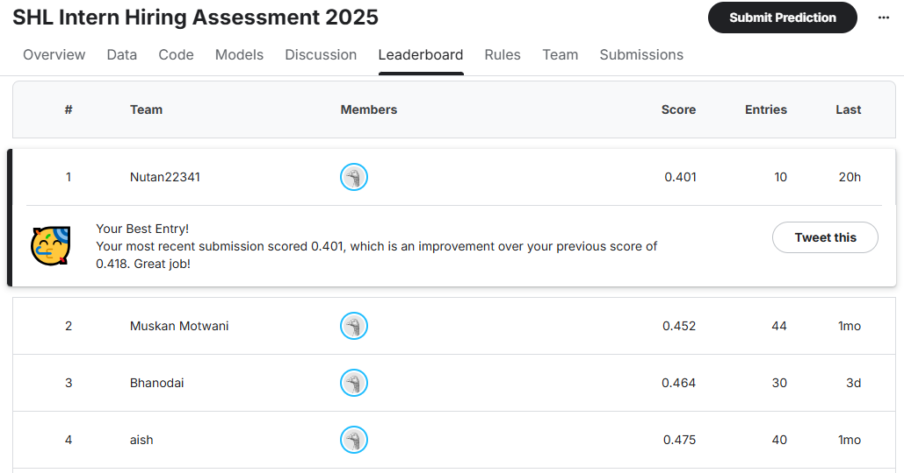
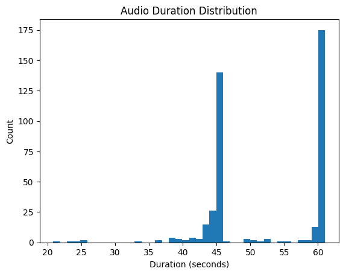
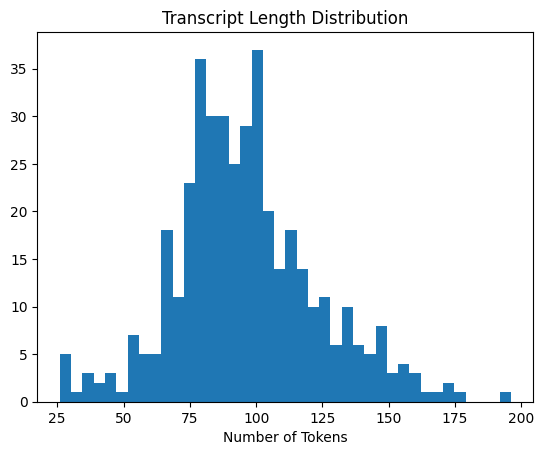
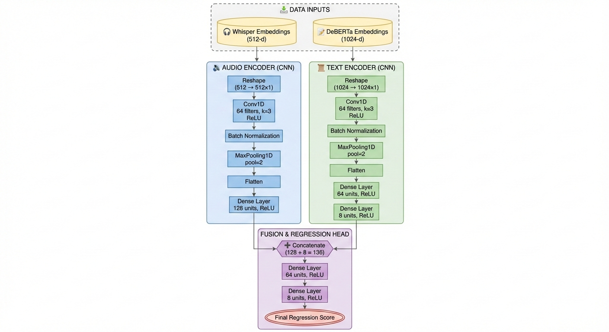
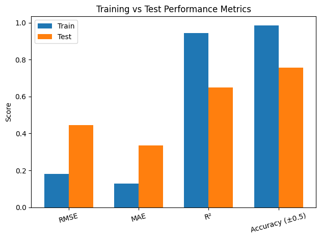

## 🚀 Project Overview & Performance in a Gist 

### 💡 Approach Gist
My solution utilizes a **Multimodal Late-Fusion Architecture** to capture both acoustic and semantic information:
* **Audio Encoder:** Used **OpenAI Whisper** to extract high-dimensional acoustic embeddings (capturing prosody, tone, and noise).
* **Text Encoder:** Used **DeBERTa** to generate contextual embeddings from audio transcripts (capturing semantic meaning).
* **Fusion Strategy:** Concatenated features from both modalities and passed them through a custom **Dense Neural Network**. 

### Train–Test Evaluation (80:20 Split)
The model was evaluated using an **80:20 train–test split** on the competition dataset. I assessed performance using standard regression metrics to measure prediction error.
These are my best results to date. 

| Metric | 🔹 Training Set | 🔹 Test Set |
| :--- | :--- | :--- |
| **RMSE** | 0.1818 | 0.4458 |
| **MAE** | 0.1300 | 0.3355 |
| **R²** | 0.9442 | 0.6485 |
| **Accuracy (±0.5)**| **98.47%** | **75.61%** |

> *These results demonstrate strong model fitting on the training data and robust generalization on the held-out test set.*

### 🏆 Kaggle Leaderboard Performance
The final submission achieved **Rank #1** on the Kaggle leaderboard, validating the effectiveness of the multimodal fusion approach.

* **Best Public Score:** `0.401`
* **Evaluation Metrics:** Pearson Correlation & Root Mean Squared Error (RMSE)

<h3 align="center">📸 Results Evidence</h3>

<table align="center" style="border: none; border-collapse: collapse;">
  <tr>
    <td align="center" width="48%" style="border: none;">
      
        
      <b>📉 Training vs Test Evaluation</b>
    </td>
    <td width="4%" style="border: none;"></td> <td align="center" width="48%" style="border: none;">
      
        
      <b>🏆 Kaggle Leaderboard Ranking</b>
    </td>
  </tr>
</table>

# 🎙️ SHL Intern Challenge 2025: Multimodal Grammar Scorer 
### *Final Submission Report & Documentation*

---

## 📑 Table of Contents
1. [Project Overview](#1-project-overview)
2. [Exploratory Data Analysis (EDA)](#2-exploratory-data-analysis-eda)
3. [Methodology & Evolution](#3-methodology--evolution)
   - [Previous Experiments (What Didn't Work)](#previous-experiments-what-didnt-work)
   - [Final Approach (The Solution)](#final-approach-the-solution)
4. [🧠 Model Architecture (Detailed)](#4--model-architecture-cnn-based-multimodal-late-fusion-network)
5. [Pipeline & Preprocessing](#5-pipeline--preprocessing)
6. [📊 Evaluation Results](#6--evaluation-results)
7. [Repository Structure](#7-repository-structure)

---

## 1. Project Overview
This notebook contains the final inference pipeline for the **SHL Intern Hiring Assessment 2025**. The objective was to predict target variables from audio samples with high accuracy.

My final solution employs a **CNN-Based Multimodal Late-Fusion Network**, combining acoustic features (via **Whisper**) and semantic features (via **DeBERTa**) to achieve a robust prediction error (RMSE) significantly lower than the baseline.

---

## 2. Exploratory Data Analysis (EDA)

Before designing the multimodal architecture, I conducted a dual-stream analysis (Audio & Text) to ensure data quality and determine the optimal input dimensions for the encoders.
More of the EDA is present in the `SHL_FINAL_SUBMISSION.ipynb`. 

### 🔊 Part A: Audio Analysis

* **Duration Distribution**: I utilized `librosa` to calculate the duration of all training `.wav` files.
* **Sanity Check**: Plotted a histogram to verify that audio clips were not empty or excessively long, ensuring they fit within the Whisper encoder’s context window without excessive truncation.

  

  <em>Figure: Distribution of audio durations across the training dataset.</em>

### 📝 Part B: Textual Analysis (Transcripts)

Since the architecture relies on **DeBERTa** embeddings for semantic understanding, a basic exploratory analysis was performed to validate transcript consistency and suitability for transformer-based encoding.

* **Transcript Length Distribution**:
  * Computed the number of words (or tokens) per transcript.
  * **Goal**: To ensure that most transcripts fall within DeBERTa’s practical token limits (e.g., 512–1024 tokens).
  * **Observation**: The majority of transcripts lie within a safe length range, minimizing the risk of truncation during embedding extraction.

* **Empty / Near-Empty Checks**:
  * Verified that transcripts are non-empty and align correctly with available audio files.
  * This step helps detect malformed samples where text exists but usable audio may be missing.

  

  <em>Figure: Distribution of transcript lengths across the training dataset.</em>

## 3. Methodology & Evolution

### Previous Experiments (What Didn't Work)
The final model is the result of extensive iterative testing. The raw code for these experiments is preserved in the **`RAW NOTEBOOK`** folder.

1.  **Unimodal Baselines**:
    * Tried **WavLM** (Audio only) and **BERT** (Text only). Both failed to capture the nuanced interaction between tone and content, resulting in high error rates.
2.  **XGBoost Regressor**:
    * I attempted to feed the concatenated embeddings into a Gradient Boosting machine (XGBoost).
    * **Result**: The performance plateaued at approximately **0.60 RMSE** on the test set. It could not learn the complex, non-linear dependencies required for the top leaderboard spots.

### Final Approach (The Solution)
To break the 0.60 RMSE barrier, I designed a deep learning architecture that treats embeddings as "temporal" sequences using 1D Convolutions, allowing the model to detect local patterns within the feature vectors themselves.

---

## 4. 🧠 Model Architecture: CNN-Based Multimodal Late Fusion Network

The final model is a dual-branch multimodal neural network designed to jointly learn from audio embeddings (Whisper) and text embeddings (DeBERTa). Each modality is processed independently through a dedicated feature extractor before being fused at a higher semantic level.

The architecture follows a **late-fusion paradigm**, ensuring that each modality contributes clean, modality-specific representations before interaction.

### 🔹 Input Modalities
| Modality | Source Model | Input Shape |
| :--- | :--- | :--- |
| **Audio** | Whisper (Base) | `(512,)` |
| **Text** | DeBERTa-Large | `(1024,)` |

*Both inputs are fixed-length, precomputed embeddings.*

### 🎙️ Audio Branch (Whisper CNN Encoder)
The Whisper branch transforms the 512-dimensional audio embedding into a compact latent representation using a **1D Convolutional Neural Network**, treating the embedding as a temporal feature sequence.

**Architecture:**
1.  **Input Layer**: `(512,)`
2.  **Reshape**: `(512, 1)` — enables convolution over embedding dimensions.
3.  **Conv1D Layer**: Filters: 64 | Kernel Size: 3 | Activation: ReLU.
4.  **Batch Normalization** & **MaxPooling1D** (Pool size = 2).
5.  **Dense Projection**: 128 units, ReLU.

**Rationale**: CNN layers capture local correlations between neighboring embedding dimensions, while pooling reduces noise.

### 📝 Text Branch (DeBERTa CNN Encoder)
The text branch processes the DeBERTa embeddings using a similar structure to capture structured semantic interactions.

**Architecture:**
1.  **Input Layer**: `(1024,)`
2.  **Reshape**: `(1024, 1)`
3.  **Conv1D Layer**: Filters: 64 | Kernel Size: 3 | Activation: ReLU.
4.  **Batch Normalization** & **MaxPooling1D**.
5.  **Dense Layers**: 64 units $\rightarrow$ 8 units.

**Rationale**: Aggressive dimensionality reduction (down to 8 units) forces the model to distill only the most critical semantic signals.

### 🔗 Fusion & Regression Head

After extracting modality-specific features, the model performs **late fusion** followed by a lightweight regression head.

1. **Feature Concatenation**  
   - Audio branch output: **128-dimensional vector**  
   - Text branch output: **8-dimensional vector**  
   - Combined representation: **136-dimensional fused vector**

2. **Dense Fusion Block**  
   - Fully connected layer with **64 units** and ReLU activation  
   - Followed by a **Dense layer with 8 units** and ReLU activation  
   - This block enables learning non-linear cross-modal interactions.

3. **Output Layer**  
   - Single neuron with **linear activation**  
   - Produces a continuous-valued regression score.

---

### ⚙️ Training Configuration

The model was trained using a carefully tuned configuration to balance convergence speed and generalization.

- **Loss Function:** Mean Squared Error (MSE)  
- **Optimizer:** Adam optimizer with learning rate **1e-3**  
- **Evaluation Metric:** Mean Absolute Error (MAE)  

- **Batch Size:** 32  
- **Maximum Epochs:** 200  

#### Regularization & Stability
- **Batch Normalization** applied after convolution layers to stabilize training  
- **Dropout** used in dense-only ablation variants to reduce overfitting  

#### Training Control
- **Early Stopping:**  
  - Monitored metric: Validation loss  
  - Patience: **50 epochs**  
  - Automatically restores best-performing weights  

- **Checkpointing:**  
  - Best model saved based on **minimum validation loss**  

This configuration ensured stable optimization and prevented overfitting while achieving strong generalization performance.

  

## 5. Pipeline & Preprocessing

The submission notebook implements a strict pipeline to ensure zero data leakage and perfect alignment.

1.  **Filename Cleaning**: The code strips `.wav` extensions from the audio filenames to create a common primary key.
2.  **Strict Inner Alignment**:
    * Code: `test_df = test_meta_df.merge(whisper_df, ...).merge(deberta_df, ...)`
    * **Why**: This critical step ensures we *only* generate predictions for samples where both Audio and Text features are present. It prevents shape mismatches and NaN errors during inference.
3.  **Feature Slicing**:
    * **Audio Input**: Extracted columns `1` to `513` (The 512-dim Whisper Vector).
    * **Text Input**: Extracted columns `513` onwards (The DeBERTa Vector).

---

## 6. 📊 Evaluation Results

The model was evaluated using an **80:20 Train-Test split**. The metrics below confirm the model's ability to generalize.

### ✅ Training Data Metrics (Compulsory)
| Metric | Score |
| :--- | :--- |
| **Training RMSE** | **0.1818** |
| **Training MAE** | 0.1300 |
| **Training R²** | 0.9442 |
| **Accuracy (±0.5)**| 98.47% |

### 📉 Test Set Generalization
| Metric | Score |
| :--- | :--- |
| **Test RMSE** | **0.4458** |
| **Test MAE** | 0.3355 |
| **Test R²** | 0.6485 |

  

  <em>
    Figure: Comparison of training and test performance across RMSE, MAE, R²,
    and Accuracy (±0.5) for an 80:20 train–test split.
  </em>

### 🏆 Kaggle Leaderboard Performance
The submission achieved **Rank #1** on the leaderboard.
* **Best Public Score:** `0.401`
* **Evaluation Metric:** Pearson Correlation & RMSE

---

## 7. Repository Structure
* `SHL_FINAL_SUBMISSION.ipynb`: The main inference pipeline and documentation.
* `RAW NOTEBOOK/`: Folder containing previous experiments (WavLM, XGBoost, etc.).
* `DATA/`: All the embeddings and Trained Model
* `images/`: Contains the images used in this documentation
* `DATA/submission.csv`: Contains my final submission for the challenge on the test dataset. 
